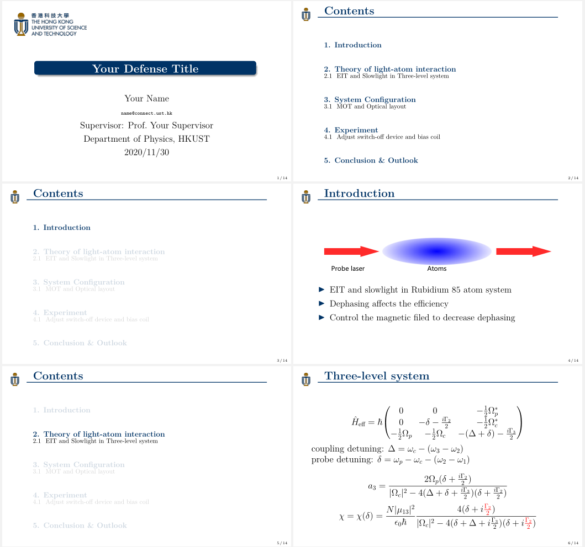

# HKUST-defense-template

A backup for my MPhil defense template.

## Preview:

## Usage

1. prepare your own text, figures and citations.
1. `` make full `` to run a full build for the first time.
1. `` make `` or `` make again `` to update if there is no change in citations.
1. `` make clean `` to clean up.

## Known Issue

由于字体版权原因，非Windows用户可能需要手动更改 `` style.sty `` 中的字体为所拥有的字体：MacOS用户可以改为STSong、STKaiti、STHeiti，Linux用户可以改为合适的字体。
